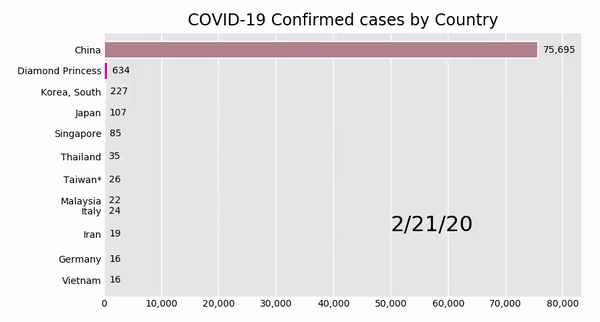

# Covid-19 Time Series Graph
John Hopkins' [Covid-19 dataset](https://raw.githubusercontent.com/CSSEGISandData/COVID-19/master/csse_covid_19_data/csse_covid_19_time_series/time_series_covid19_confirmed_global.csv) is used to plot infection curves for countries and to create a racing bar chart. The output is the video shown below.

  

